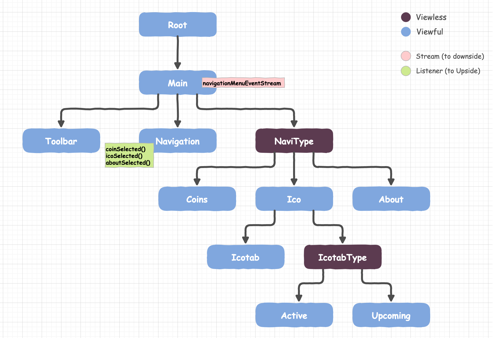

# CoinSpace

CoinSpace is an android client application for coin information. An app to demonstrate RIBs, Uber's newest mobile architecture.

# Screenshot

# Architecture 
Based on Uber's RIBs architecture.
https://github.com/uber/RIBs/wiki

# Language
Kotlin

# Tech/Tools/Libs Used

# API Used
